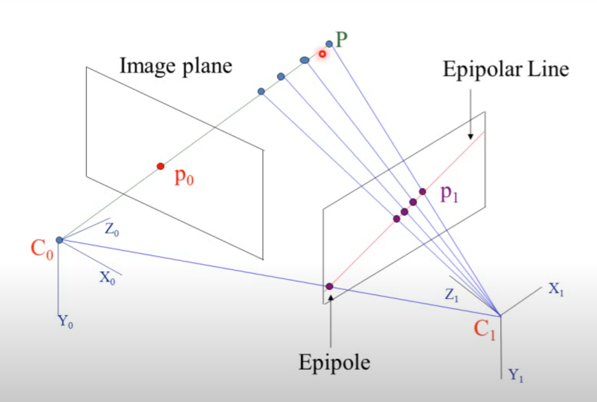

# Bundle Adjustment (Ajustamento por Feixes)

<figure><figcaption></figcaption></figure>

<figure><figcaption></figcaption></figure>

<figure><figcaption></figcaption></figure>

<figure><figcaption></figcaption></figure>

<figure><figcaption></figcaption></figure>

**Bundle Adjustment (Ajustamento por Feixes)** é um procedimento matemático essencial em **fotogrametria** e **visão computacional** que serve para **refinar simultaneamente as posições das câmeras e os pontos 3D** reconstruídos a partir de múltiplas imagens.

#### 📌 O que é?

O **Bundle Adjustment** ajusta **conjuntamente**:

* as **posições e orientações das câmeras** (parâmetros extrínsecos),
* as **características internas das câmeras** (parâmetros intrínsecos, como distância focal),
* e as **coordenadas dos pontos 3D** observados nas imagens.

Tudo isso é feito **minimizando o erro reprojetado** – ou seja, a diferença entre a **posição observada de um ponto na imagem** e a **posição prevista pela projeção do ponto 3D** com base no modelo da câmera.

***

#### 🧠 Intuição

Imagine que você tem várias fotos de um objeto (como um prédio). A partir dessas fotos, você detecta pontos em comum. O **Bundle Adjustment** “ajusta o quebra-cabeça”:

* reposiciona os pontos 3D,
* melhora a estimativa de onde estavam as câmeras quando tiraram as fotos,
* e garante que, ao projetar novamente os pontos 3D nas imagens, eles fiquem o mais próximos possível dos pontos realmente observados.

***

#### 🧮 Base matemática

O problema é formulado como uma **otimização não-linear** que minimiza uma função de custo (erro quadrático da reprojeção):

$$min⁡Xj,Pi∑i,j∥xij−π(Pi,Xj)∥2\min_{\mathbf{X}_j, \mathbf{P}_i} \sum_{i,j} \left\| \mathbf{x}_{ij} - \pi(\mathbf{P}_i, \mathbf{X}_j) \right\|^2$$

Onde:

* $$\mathbf{x}_{ij}$$ = posição observada do ponto jj na imagem ii,
* $$\pi$$ = função de projeção da câmera,
* $$\mathbf{P}_i$$ = parâmetros da câmera ii,
* $$\mathbf{X}_j$$= coordenadas 3D do ponto jj.

***

#### 🛠️ Onde é usado?

* Fotogrametria (ex: drones, levantamento topográfico)
* Reconstrução 3D em visão computacional
* Mapeamento com SLAM (Simultaneous Localization and Mapping)
* Modelagem 3D com Structure-from-Motion (SfM)

***

#### ✅ Vantagens

* Aumenta significativamente a **precisão da reconstrução 3D**
* Garante **consistência geométrica** entre imagens

***

#### Exemplo simples:

Se você usar um drone para fotografar um terreno de vários ângulos e depois reconstruir o terreno em 3D, o Bundle Adjustment garante que:

* as imagens estejam corretamente posicionadas no espaço,
* os pontos do terreno sejam corretamente triangulados,
* e as imagens se alinhem sem distorções.

***

